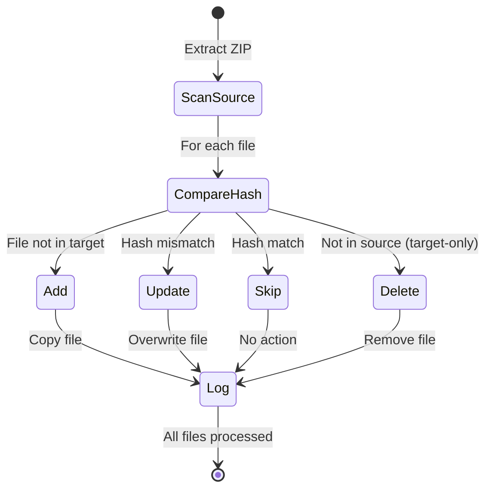
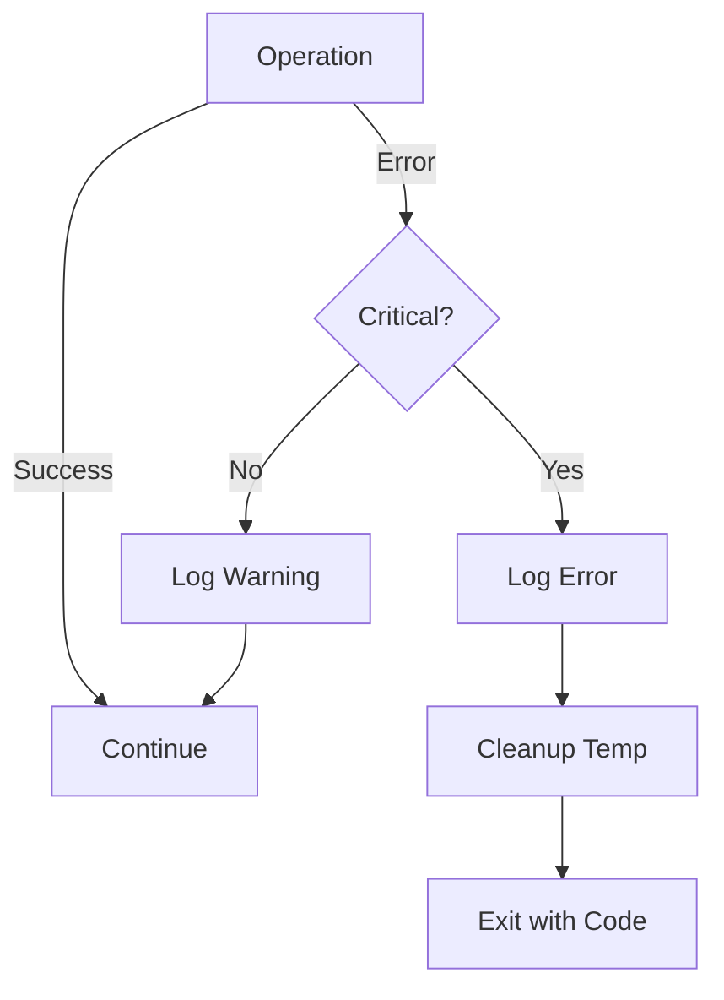

# Design: Cap2Obs Smart Sync Architecture

## Architectural Overview

Cap2Obs follows a linear pipeline architecture with four distinct stages:


## Core Design Decisions

### 1. Content Hash vs. Timestamp Comparison

**Decision:** Use content-based hashing (MD5 or SHA256) instead of file modification timestamps.

**Rationale:**
- ZIP extraction resets modification timestamps, making them unreliable for change detection
- Cloud sync services (iCloud, Git) track changes based on file modifications
- Skipping identical files preserves original timestamps, preventing unnecessary sync operations
- Reduces cloud sync traffic and version history noise

**Trade-off:** Slightly higher CPU usage for hash computation, but negligible for typical note-taking workloads (hundreds of small markdown files).

---

### 2. Fail-Fast Rollback Strategy

**Decision:** Terminate immediately on critical errors without creating local snapshots.

**Rationale:**
- Users are required to have cloud sync enabled (implicit backup mechanism)
- Complexity of snapshot management outweighs benefits for single-direction sync
- Clear error messages + exit codes enable automated retry logic in cron jobs
- Obsidian's cloud sync provides sufficient version control for recovery

**Alternative Considered:** Create `.cap2obs_backup/` snapshots before each sync.  
**Rejected Because:** Adds storage overhead, complexity, and potential for stale backup cleanup issues.

---

### 3. Language-Agnostic Specification

**Decision:** Support both Python and Node.js implementations.

**Rationale:**
- Both ecosystems provide excellent cross-platform file I/O and crypto libraries
- Python has simpler deployment (single executable via PyInstaller)
- Node.js offers better async I/O performance for large vaults
- Specification focuses on behavior, not implementation details

**Implementation Note:** Final choice should be made based on maintainer preference and existing project ecosystem.

---

### 4. Temporary Workspace Isolation

**Decision:** Extract ZIP files to `.temp_cap2obs/` in the working directory.

**Rationale:**
- Isolates extraction from target vault (prevents partial overwrites on error)
- Enables atomic sync operations (compare, then apply)
- Simplifies cleanup on both success and failure paths

**Security Consideration:** Temporary directory must be deleted even on crashes (use try-finally or process cleanup hooks).

---

## Component Interaction

### Sync Logic State Machine



### Error Propagation Flow



## Data Flow

### File Selection Algorithm

1. **Priority 1:** If `--file` specified → use exact filename
2. **Priority 2:** If `--date` specified → filter by date, select latest timestamp
3. **Priority 3:** Auto-select → scan all files, pick newest by date+time

### Hash Comparison Process

For each file in source:
```python
source_hash = hash(temp_file_content)
if file_exists_in_target:
    target_hash = hash(target_file_content)
    if source_hash == target_hash:
        action = SKIP
    else:
        action = UPDATE
else:
    action = ADD

For each file in target:
    if not file_exists_in_source:
        action = DELETE
```

## Logging Strategy

### Log Levels
- `[INFO]`: Normal operation milestones (start, finish, file count)
- `[ADD]`/`[MOD]`/`[DEL]`/`[SKIP]`: File-level operations
- `[WARN]`: Non-critical issues (missing optional config)
- `[ERROR]`: Critical failures with exit codes

### Log Outputs
- **Console (stdout):** Concise progress + summary
- **Log File (optional):** Full details including hash values, timestamps, file sizes

### Dry-Run Annotation
All actions in dry-run mode are prefixed with `[DRY-RUN]` to prevent confusion.

## Performance Considerations

### Expected Scale
- Typical vault: 100-500 markdown files
- Typical backup size: 1-10 MB (compressed)
- Hash computation: ~1ms per file (for <100KB files)
- **Estimated sync time:** <5 seconds for 500 files

### Optimization Opportunities (Future)
- Parallel hashing for large vaults (>10,000 files)
- Incremental hash caching (store hashes in `.cap2obs_cache.json`)
- Only hash files whose size changed (pre-filter optimization)

## Security Considerations

1. **Path Traversal Prevention:** Validate all extracted paths to prevent `../../` escapes
2. **Temporary File Cleanup:** Always delete temp files, even on SIGINT/SIGTERM
3. **Permission Verification:** Check read/write access before starting operations
4. **No Credential Storage:** Tool operates on local filesystems only

## Testing Strategy

### Unit Tests
- Hash computation correctness (known file → expected hash)
- Date parsing from filename strings
- Sync logic decision tree (4 scenarios)

### Integration Tests
- End-to-end sync with mock ZIP files
- Dry-run mode produces no filesystem changes
- Error handling for corrupted ZIP, permission denied

### Manual Validation
- Real Capacities backup → Obsidian vault sync
- Cloud sync verification (Git diff shows minimal changes)
- Scheduled cron execution over 7 days
