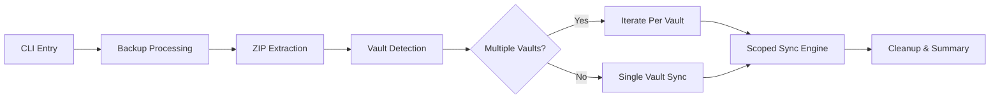
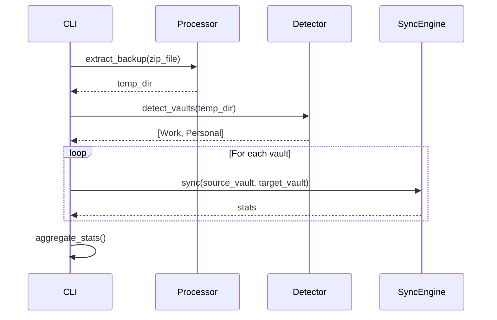

# Design: Multi-Vault Synchronization Architecture

## Architectural Changes

This change extends the existing pipeline with a new **Vault Detection** stage and modifies the sync loop:



## Design Decisions

### 1. Structure Detection Algorithm

**Decision:** Use folder naming heuristics to detect backup structure.

**Algorithm:**
```
1. List top-level items in extraction directory
2. IF only one folder AND name matches "Capacities (*)" pattern:
   → NESTED structure: enter folder, children are vaults
3. ELSE:
   → FLAT structure: top-level folders are vaults directly
```

**Rationale:**
- Capacities consistently wraps exports in a timestamped folder
- User-named vault folders never contain timestamps
- Simple heuristic avoids complex content analysis

---

### 2. Vault-to-Target Mapping

**Decision:** Use exact name matching for vault mapping.

**Mapping Logic:**
```
Source: Temp/.../Work/    →  Target: obsidian-root/Work/
Source: Temp/.../Personal/  →  Target: obsidian-root/Personal/
```

**Auto-Create:** If target vault folder doesn't exist, create it.

**Rationale:**
- Simple and predictable behavior
- Users control vault naming in Capacities
- No complex configuration files needed

---

### 3. Delete Scope Isolation

**Decision:** Implement strict scope boundaries per vault.

**Implementation:**
```python
def sync_vault(source_vault, target_root):
    target_vault = target_root / source_vault.name
    
    # ONLY sync within this vault's scope
    sync_engine.sync(source_vault, target_vault)
    
    # Delete scope is limited to target_vault
    # Files in target_root but outside target_vault are NEVER deleted
```

**Rationale:**
- Prevents catastrophic data loss
- Allows mixed usage (some vaults from Capacities, others purely Obsidian)
- Clear mental model for users

---

### 4. Backwards Compatibility

**Decision:** Support `--obsidian-vault` as deprecated alias.

**Implementation:**
```python
parser.add_argument(
    "--obsidian-root",
    dest="obsidian_root",
    ...
)
parser.add_argument(
    "--obsidian-vault",
    dest="obsidian_root",  # Same destination
    help=argparse.SUPPRESS,  # Hide from help
)
```

**Deprecation Warning:** Log warning if `--obsidian-vault` is used.

---

## Data Flow

### Multi-Vault Sync Sequence



## Example Scenarios

### Scenario 1: Multi-Vault Backup

**Input:**
```
Backup: Capacities (2026-01-30).zip
Extracted: /temp/Capacities (2026-01-30)/
├── Work/
└── Personal/

Obsidian Root: /obsidian/
├── Work/
├── Personal/
└── Family/  (not in backup)
```

**Output:**
```
Sync Work:     Temp/.../Work/     → /obsidian/Work/     ✓
Sync Personal: Temp/.../Personal/ → /obsidian/Personal/ ✓
Family:        NOT TOUCHED (scope protection)
```

---

### Scenario 2: Single Vault Backup

**Input:**
```
Backup: Capacities (2026-01-30).zip
Extracted: /temp/Work/  (no nested wrapper)

Obsidian Root: /obsidian/
├── Work/
└── Family/
```

**Output:**
```
Detected: Single vault "Work"
Sync Work: Temp/Work/ → /obsidian/Work/ ✓
Family:    NOT TOUCHED (different vault scope)
```

---

### Scenario 3: New Vault in Backup

**Input:**
```
Backup contains: Work, Personal, NewProject
Obsidian Root contains: Work, Personal
```

**Output:**
```
Sync Work:       existing vault updated
Sync Personal:   existing vault updated
Sync NewProject: target folder CREATED, content synced
```

## Error Handling

### Empty Vault Detection

If a detected vault folder is empty:
- Log warning: `[WARN] Empty vault detected: VaultName`
- Skip sync for that vault
- Continue with remaining vaults

### Permission Errors

If permission denied on specific vault:
- Log error for that vault
- Continue syncing other vaults
- Report partial failure in summary

## Statistics Aggregation

Combine stats from all vault syncs:

```python
total_stats = SyncStats()
for vault in vaults:
    stats = sync_vault(vault)
    total_stats.added += stats.added
    total_stats.modified += stats.modified
    total_stats.deleted += stats.deleted
    total_stats.skipped += stats.skipped
```

Log per-vault progress and final aggregate summary.
